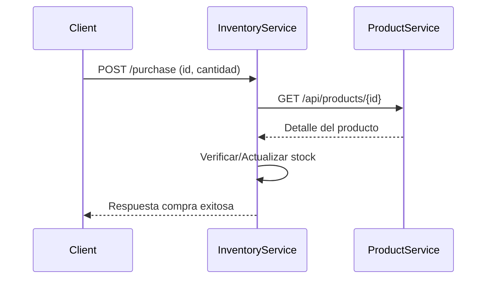

## 📦 Product Inventory - Microservicios

Este proyecto implementa una arquitectura basada en microservicios para gestionar productos e inventario, con comunicación entre servicios vía HTTP y seguridad mediante API Keys.

Repositorio general: [https://github.com/Jonathan0148/products-inventory.git](https://github.com/Jonathan0148/products-inventory.git)

> 📌 Este repositorio combina ambos microservicios para facilitar la orquestación con Docker. Cada microservicio también se encuentra de forma independiente en:
>
> - Repositorio de Productos: [https://github.com/Jonathan0148/productinventory.git](https://github.com/Jonathan0148/productinventory.git)
> - Repositorio de Inventario: [https://github.com/Jonathan0148/inventoryproduct.git](https://github.com/Jonathan0148/inventoryproduct.git)

---

### 1️⃣ Instrucciones de instalación y ejecución

#### 🚀 Requisitos

- Docker y Docker Compose instalados
- Java 17
- Maven 3.9.x

#### 🧱 Clonar el repositorio principal

```bash
git clone https://github.com/Jonathan0148/products-inventory.git
cd products-inventory
```

#### 🛠️ Construir los microservicios

```bash
cd product
./mvnw clean package -DskipTests
cd ../inventory
./mvnw clean package -DskipTests
cd ..
```

#### 🐳 Levantar todos los servicios con Docker

```bash
docker-compose up --build
```

Servicios levantados:

- `product-inventory`: [http://localhost:8080](http://localhost:8080)
- `inventory`: [http://localhost:8081](http://localhost:8081)
- Bases de datos Postgres en puertos 5432 (productos) y 5433 (inventario)

---

### 2️⃣ Descripción de la arquitectura

El sistema se compone de:

- **Microservicio de Productos**
  - CRUD de productos
  - Exposición del API de consulta para otros servicios
- **Microservicio de Inventario**
  - Consulta y actualización de stock
  - Realiza peticiones al microservicio de productos para verificar existencia del producto
- **PostgreSQL** para persistencia, cada servicio con su propia instancia

**Comunicación:** vía HTTP interna usando nombres de servicio (`product-inventory`) gracias a Docker Compose.

**Seguridad:** autenticación entre servicios con API Keys.

**Base de datos:** se eligió PostgreSQL por ser un motor SQL robusto, ampliamente adoptado en la industria, con excelente soporte en entornos productivos y compatibilidad con Spring Boot.

**Justificación sobre la base de datos:**

- No se optó por SQLite debido a sus limitaciones de concurrencia y escalabilidad, lo cual no es ideal para operaciones críticas como inventario en tiempo real.
- No se usó NoSQL porque los modelos requeridos tienen relaciones estructuradas (producto ↔ inventario) que encajan mejor en un modelo relacional. Además, SQL ofrece transacciones ACID y validaciones de integridad que son clave para evitar inconsistencias en compras.

---

### 3️⃣ Decisiones técnicas y justificaciones

- **Separación de microservicios:** permite escalabilidad independiente y separación de responsabilidades.
- **Uso de API Keys:** implementado a nivel de filtros para proteger endpoints entre servicios.
- **Base de datos separada por servicio:** cada microservicio tiene su propia fuente de verdad.
- **Endpoint de compra en Inventory:** se decidió implementar el endpoint de compra en el servicio de inventario, ya que:
  - Es donde se maneja el stock.
  - Es responsable de validar existencia del producto vía consulta al microservicio de productos.
  - Sigue la lógica de “ownership” del dominio.
- **Bounded Context y Single Responsibility:** cada microservicio tiene un contexto delimitado y responsabilidades claras:
  - El microservicio de productos se ocupa únicamente de operaciones CRUD sobre productos.
  - El microservicio de inventario maneja exclusivamente la lógica de inventario y el proceso de compra. Esta división respeta el principio de responsabilidad única y evita acoplamientos innecesarios.

---

### 4️⃣ Diagrama de interacción entre servicios



---

### 5️⃣ Flujo de compra implementado

1. El cliente envía una solicitud de compra al endpoint del microservicio de inventario.
2. Inventory consulta al microservicio de productos para validar existencia del producto.
3. Si el producto existe:
   - Se verifica el stock.
   - Se actualiza la cantidad disponible.
   - (Opcional) Se guarda historial de compras.
4. Se retorna una respuesta indicando éxito o error.

---

### 6️⃣ Uso de herramientas de IA en el desarrollo

Durante el desarrollo se utilizó **ChatGPT (GPT-4o)** como herramienta de acompañamiento técnico para:

- Validar estructuras arquitectónicas y decisiones de diseño.
- Revisar flujos de lógica y detectar errores potenciales.
- Proponer buenas prácticas y mejoras en la calidad del código.

🧠 Todas las recomendaciones fueron evaluadas críticamente y adaptadas al contexto del proyecto.

---

### 📬 Documentación de APIs

- Swagger UI para cada microservicio:
  - [http://localhost:8080/swagger-ui/index.html](http://localhost:8080/swagger-ui/index.html)
  - [http://localhost:8081/swagger-ui/index.html](http://localhost:8081/swagger-ui/index.html)

---

### 📁 Postman

En la raíz del proyecto encontrarás:

- 📨 **Colección de Postman** con todos los endpoints documentados.
- 🌐 **Environment de Postman** con API Keys y hosts preconfigurados.

---

### 🧪 Pruebas

Cada microservicio contiene:

- ✅ **Pruebas unitarias** completas con JUnit.
- 🔁 **Pruebas de integración** que simulan escenarios reales (con base de datos y llamadas HTTP).

#### Ejecutar pruebas unitarias

Desde la raíz de cada microservicio:

```bash
./mvnw test
```

#### Ejecutar pruebas de integración

Las pruebas de integración se ejecutan automáticamente durante el proceso de build con:

```bash
./mvnw clean verify
```

También pueden ejecutarse individualmente desde el IDE o con comandos específicos por clase.

---

✅ Proyecto listo para ser probado, desplegado y ampliado según futuras necesidades del sistema.

